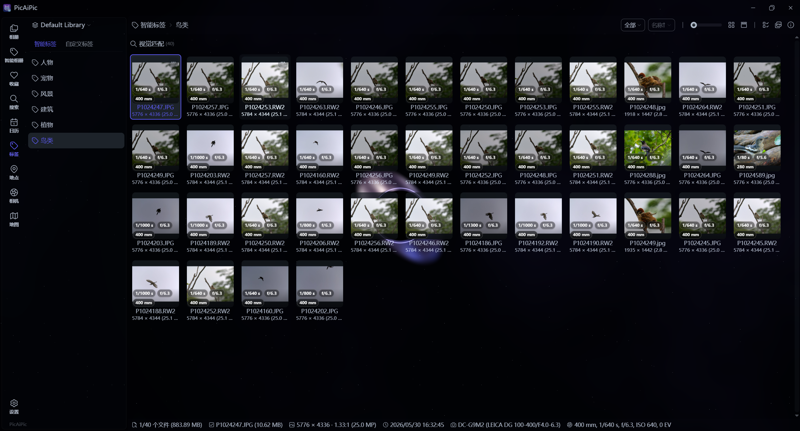

<div align="center">
  
  <h1>PicAiPic - Private Local Photo Manager</h1>
  <h3>Local-first desktop photo manager for Windows and Linux.</h3>
  <p>
    <a href="https://github.com/big2cater/picaipic/releases"></a>
    <a href="https://github.com/big2cater/picaipic/releases"></a>
    <a href="https://github.com/big2cater/picaipic/stargazers"></a>
  </p>
</div>


English | [简体中文](i18n/README.zh-CN.md)

PicAiPic is a local-first photo manager for browsing family albums, finding old photos quickly, and managing large personal media libraries offline.
It works directly with your existing folders and keeps indexing, thumbnails, metadata, semantic search, face processing, and editing on your own computer. No cloud account or media upload is required.

- Website: [https://big2cater.github.io/picaipic/](https://big2cater.github.io/picaipic/)
- Demo: [https://youtu.be/RbKqNKhbVUs](https://youtu.be/RbKqNKhbVUs)
- Privacy: [PRIVACY.md](PRIVACY.md)

## Download PicAiPic

Open the [latest release page](https://github.com/big2cater/picaipic/releases/latest), then download the file that matches your system:

| Platform | Package | Note |
| :-- | :-- | :-- |
| **Windows 10/11 (x64 / ARM64)** | `_x64_en-US.msi` / `_arm64_en-US.msi` | Unsigned — if SmartScreen blocks the download, click **Keep anyway** |
| **Linux (amd64 / arm64)** | `_amd64.deb` / `_arm64.deb` | For Debian-based distros (Ubuntu, Debian, Linux Mint, etc.) |

## Screenshots

<p align="center">
  
</p>

<p align="center"><em>Smart Tags view with RAW/JPEG metadata badges, virtualized browsing, and the Black hole theme.</em></p>

## Why PicAiPic

- **Local-first by design**: your photos stay on your own disk, with no required cloud account or upload.
- **No library lock-in**: work directly with your existing folders instead of importing everything into a closed database.
- **Private AI tools**: semantic search, similarity, smart tags, embeddings, and face features run locally on your machine.
- **Built for large collections**: virtualized browsing, cached repeat scans, batched local inference, and exact vector search are designed for 10k-100k+ file libraries.
- **No subscription or forced ecosystem**: the application and its local data remain under your control.

## Features

### Browse and Organize

- **Fast virtualized photo grid** with configurable thumbnail size, metadata badges, date grouping, selection, sorting, and smooth scrollbar jumps.
- **Multiple folder-based libraries** with incremental scanning, thumbnail/embedding reuse, drag-and-drop import, copy-paste import, and filesystem synchronization.
- **Library views** for timeline, calendar, folders, location/map, camera, lens, tags, favorites, ratings, people, and file types.
- **Smart Tags** for people, pets, scenery, architecture, plants, and other locally searchable visual groups.
- **Smart Albums** with composable rules, all/any matching, dates, size, people, camera/lens, sorting, and saved dynamic results.
- **Collections** for manually grouping files without moving the originals.
- **Duplicate cleanup** with exact hashing and visual similarity modes, plus guarded trash/permanent-delete workflows.

### Local AI and Plugins

- **On-device semantic search** with English/Chinese text search, visual similarity, smart tags, and 512-dimensional local image embeddings.
- **Face detection and clustering** with local ONNX models and large-set nearest-neighbor support.
- **Independent AI plugins** with signed packages, publisher trust, explicit permissions, bearer-token loopback authentication, runtime profiles, model bindings, input staging, progress/cancellation, and controlled output adoption.
- **Lifecycle-aware plugin actions**: contributed tools such as SA-LUT appear only while their managed runtime is reachable.

### Edit and Create

- **Image editor** with crop presets, rotate, flip, resize, exposure/color adjustments, and non-destructive save-as workflows.
- **Collage maker** with equal, magazine, strip, and free-canvas layouts.
- **Batch processing** for crop/resize/borders, expansion, watermarks, text, and optional EXIF capture-time stamps.
- **Photo styles and LUTs** with a local `.cube` library, manual controls, recipes, and batch application.
- **Traditional color match** for matching the global Lab color character of a reference image and exporting a reusable style LUT.
- **Photo frames and print layouts** with EXIF information bars, float/sink blur layouts, optional logos, DPI-aware output, and system printing.

### Media and Experience

- **Live Photo / Motion Photo** support for Apple pairs (HEIC/JPEG + MOV), Google Motion Photos (embedded MP4), and HEIC-internal video; long-press preview, export/convert, confirmed JPEG keyframe replacement, and album metadata repair. See the [Live Photo guide](docs/guide/live-photo.md).
- **Broad media support** for 60+ image, RAW, and video formats through LibRaw, libheif, libjpeg-turbo, jxl-oxide, FFmpeg, and Rust image codecs.
- **Five visual themes**: Default, Retro, CMYK, Black hole, and Cyberpunk. The two dynamic themes include guarded maximized-window idle effects.
- **Windows and Linux releases only**, with x64/ARM64 Windows packages and x86_64/ARM64 Linux packages.

## Uninstall PicAiPic

PicAiPic works directly with your existing photo folders. Uninstalling PicAiPic, or deleting its database and cache files, does **not** delete your original photos.

The standard uninstall steps remove the application. To remove PicAiPic completely, quit PicAiPic first, uninstall the application, then delete its local database, thumbnail cache, and configuration files using the cleanup command for your platform.

### Windows

Open **Settings > Apps > Installed apps**, find **PicAiPic**, and select **Uninstall**.

Then open PowerShell and remove all PicAiPic database, cache, and configuration files:

```powershell
Remove-Item -Recurse -Force -ErrorAction SilentlyContinue "$env:LOCALAPPDATA\com.big2cater.picaipic"
Remove-Item -Recurse -Force -ErrorAction SilentlyContinue "$env:APPDATA\com.big2cater.picaipic"
```

### Linux

For Debian-based distributions, uninstall the package:

```bash
sudo apt remove picaipic
```

Then remove all PicAiPic database, cache, and configuration files:

```bash
rm -rf "$HOME/.local/share/com.big2cater.picaipic" \
       "$HOME/.cache/com.big2cater.picaipic" \
       "$HOME/.config/com.big2cater.picaipic"
```

If you selected a custom database storage directory in PicAiPic settings, delete that directory separately after confirming that it contains only PicAiPic database files.

## Current Development Focus

PicAiPic is now on the `v1.1.0` development line. A private draft multi-architecture release may exist, but it is not considered published until the owner promotes it. Recent work completed:

- smoother large-library browsing through stale viewport cancellation, deduplicated thumbnail/metadata requests, lazy per-card menus, and contained GPU-friendly virtual item positioning
- faster warm rescans through scan-local folder/file-state caches and bounded timestamp transactions; a 10,343-file unchanged rescan improved from 10.164s to 8.786s
- batched local CLIP embedding, bounded preprocessing prefetch, lower startup matrix allocation, and exact-search-by-default behavior validated with 110k vectors
- signed AI plugin packages, publisher trust, bearer-token authentication, permission/setup flows, runtime conflict gates, and input-file staging
- plugin-contributed actions such as SA-LUT appear only while the managed plugin runtime is reachable; start/stop/restart state is synchronized across windows
- built-in crop, collage, batch processing, print layouts, color match, LUT/photo styles, photo frames, smart albums, collections, and Live Photo / Motion Photo workflows
- a refreshed application icon across Windows packaging, Linux/shared PNG assets, title bars, About/Welcome views, and documentation
- a Windows/Linux-only release scope; Android/iOS assets and macOS bundle/native bridge files have been removed

The highest-priority remaining work is release-executable regression, representative cold-import/embedding profiling, signing-key rotation/revocation design, and stronger network/Linux plugin isolation beyond default input staging. See [v1.1.0 release notes](docs/guide/release-notes/v1.1.0.md) and the [development progress board](docs/guide/picaipic-progress.md).

## Build from Source

Requirements: Node.js 20+, pnpm, Rust stable.

```bash
# Linux system deps
# sudo apt install libwebkit2gtk-4.1-dev libappindicator3-dev librsvg2-dev \
#   patchelf nasm clang pkg-config autoconf automake libtool cmake

# Clone and build
git clone --recursive https://github.com/big2cater/picaipic.git
cd picaipic
git submodule update --init --recursive
cargo install tauri-cli --version "^2.0.0" --locked
./scripts/download_models.sh            # Windows: .\scripts\download_models.ps1
./scripts/download_ffmpeg_sidecar.sh    # Windows: .\scripts\download_ffmpeg_sidecar.ps1
cd src-vite && pnpm install && cd ..
cargo tauri dev
```

## Supported Formats

PicAiPic supports 60+ photo, RAW, and video formats.

| Type | Formats |
| :--- | :--- |
| Images | JPG/JPEG, PNG, GIF, BMP, TIFF, WebP, HEIC/HEIF/HIF, AVIF, JXL, PSD, EXR, HDR/RGBE, TGA, JPEG 2000 (JP2/J2K/J2C/JPC/JPF/JPX), DDS, DPX, QOI |
| RAW photos | CR2, CR3, CRW, NEF, NRW, ARW, SRF, SR2, RAF, RW2, ORF, PEF, DNG, SRW, RWL, MRW, 3FR, MOS, DCR, KDC, ERF, MEF, RAW, MDC |
| Videos | MP4, MOV, M4V, MKV, AVI, FLV, TS/M2TS, WMV, WebM, 3GP/3G2, F4V, VOB, MPG/MPEG, ASF, DIVX and more. H.264 playback is supported on all platforms, with automatic compatibility processing when native playback is unavailable. |

### Linux Video Playback Notes

On Ubuntu/Debian/Linux Mint, install these packages for better video playback support:

```bash
sudo apt install gstreamer1.0-libav gstreamer1.0-plugins-good
```

## Architecture

- Core: Tauri + Rust
- Frontend: Vue + Vite + Tailwind CSS
- Data: SQLite

### Key Libraries

| Library | Purpose |
| :-- | :-- |
| [LibRaw](https://github.com/LibRaw/LibRaw) | RAW image decoding and thumbnail extraction |
| [libheif](https://github.com/strukturag/libheif) | HEIC/HEIF/HIF image decoding and preview generation |
| [libjpeg-turbo](https://libjpeg-turbo.org/) | Fast JPEG decoding and thumbnail generation |
| [FFmpeg](https://ffmpeg.org/) | Video processing and thumbnail generation |
| [Video.js](https://videojs.com/) | Cross-platform video playback UI |
| [ONNX Runtime](https://onnxruntime.ai/) | Local AI model inference engine |
| [CLIP](https://github.com/openai/CLIP) | Image-text similarity search |
| [InsightFace](https://github.com/deepinsight/insightface) | Face detection and recognition |
| [Leaflet](https://leafletjs.com/) | Interactive map for geotagged photos |
| [daisyUI](https://daisyui.com/) | UI component library |

## License

GPL-3.0-or-later. See [LICENSE](LICENSE).
