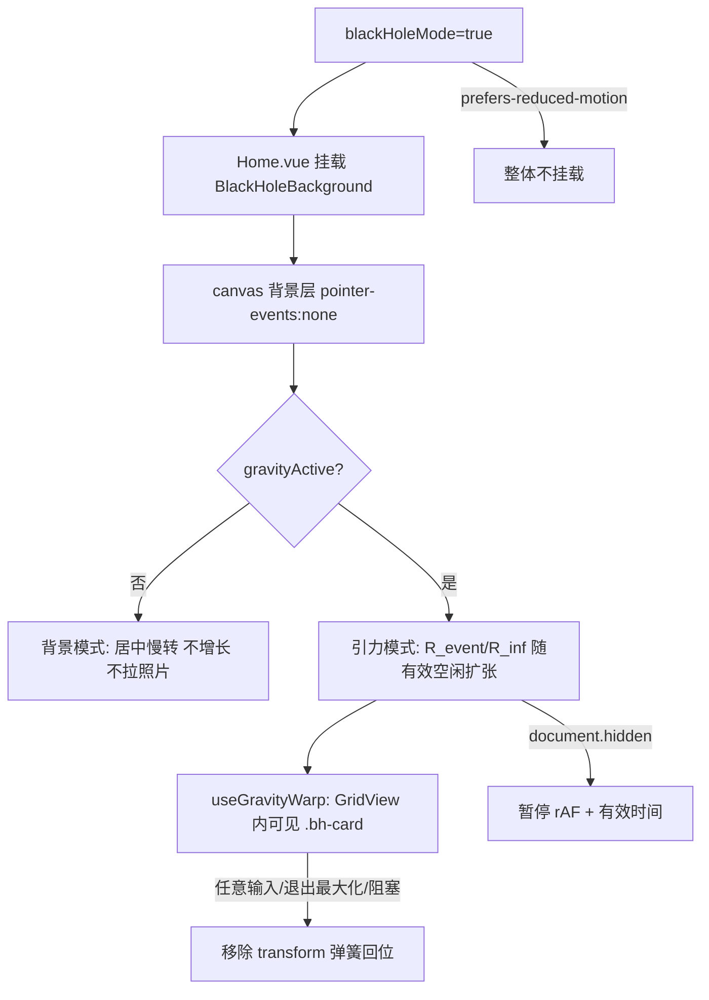

# 黑洞主题（Black Hole Idle Theme）设计文档

> 状态：设计稿 v1.3（已微调 + 硬伤修订 + 落地提示，待实现）
> 范围：纯前端（`src-vite`），不触及 Rust / Tauri 命令 / Track C 模型栈 / DaisyUI `data-theme`
> 目标：可选开启的「黑洞主题」——黑洞居中，平时只作界面氛围背景；当**主窗**最大化且用户空闲 15 秒后，黑洞缓慢变大，引力把**主网格可见照片**拉向事件视界并环绕（不消失、可随时回弹）。

---

## 0. 相对 v1 的修订摘要

| v1 | v1.1 |
|---|---|
| 挂 `App.vue` | 挂 **`Home.vue`**（避免 Settings / ImageViewer / ImageEditor 也出黑洞） |
| warp 宿主 `Content.vue` | 宿主 **`GridView.vue`**（虚拟列表与可见卡片的真实所在） |
| 未写阻塞 UI | **`inputStack` 非空 / 库切换遮罩** 时不启引力 |
| 多窗未区分 | 仅主窗 Home；独立大图窗与主窗行为独立 |
| reduced-motion 可静态 | 本期 **整关**（不挂背景、不跑引力） |
| 胶片条未写清 | **GridView 内卡片会吸**（含胶片条模式下的条内缩略图）；预览 `MediaViewer` 本身不吸 |
| `isMaximized` 含糊 | **新增** `uiStore.isMaximized`；`TitleBar` **仅** `viewName==='Home'` 时写入（共享组件硬约束） |
| `gravityActive` 源混写 | **仅在 `Home.vue` computed 组装**，composable / GridView **只消费布尔** |

---

## 1. 已锁定的产品决策

| 决策点 | 结论 |
|---|---|
| 形态 | 独立可选「黑洞主题」（opt-in），**非** DaisyUI 主题替换，非默认 |
| 黑洞位置 | 屏幕正中央（视口中心，不跟随鼠标） |
| 作用范围 | **仅主窗 Home 的 `GridView` 缩略图**（含胶片条模式条内卡片） |
| 不作用 | 侧栏、地图、FileInfo、独立 ImageViewer/Editor/Settings 窗、Content 内嵌预览大图本身 |
| 黑洞行为 | **禁止静止增长**：触发后缓慢变大（半径/引力范围随有效空闲时长扩张） |
| 照片结局 | 弯折聚拢在事件视界边缘**环绕**（不消失，`opacity` 保持 1） |
| 回弹 | 任意输入 / 退出最大化 / 阻塞 UI / 关开关 → 立即清除 transform，CSS 过渡回位 |
| 生效条件 | **系统窗口最大化**（`uiStore.isMaximized`）**且** 空闲 15 秒 **且** 网格可玩（见 §4） |
| 平时（未最大化或未空闲） | 开关开着时：黑洞仅作居中静态/慢转氛围背景，不增长拉照片 |
| 阻塞 UI 时 | **不启引力**；**静态黑洞背景仍显示** |
| 独立大图窗 | 大图窗不挂特效；主窗若仍满足条件可继续引力 |
| 无障碍 | `prefers-reduced-motion: reduce` 时**整体禁用** |

---

## 2. 架构总览



### 2.1 组件职责

| 单元 | 职责 | 不负责 |
|---|---|---|
| `configStore.settings.blackHoleMode` | 持久总开关 | 窗口/空闲/绘制 |
| `uiStore.isMaximized` | **主窗**系统最大化真相源（**本期新增**，当前 store 无此字段） | 特效；其它窗口最大化 |
| `TitleBar`（共享） | **仅** `viewName==='Home'` 时同步 `uiStore.isMaximized` | Settings / ImageEditor 的 TitleBar 不得写该字段 |
| `useIdle` | 全局 15s 空闲（建议在 Home 生命周期内） | 是否最大化 / 是否可玩 |
| `BlackHoleBackground` | canvas 背景与半径增长 | 改卡片 DOM |
| `useGravityWarp` | 消费 `gravityActive` + 半径；节流写 `.bh-card` | 自己拼 `inputStack` / `isSwitchingLibrary` 等源 |
| `GridView` | warp 查询根 / 传入或注入 `gravityActive` | 组装全局 UI 条件 |
| `Thumbnail` | **外层 root** 加 `.bh-card`（非 `containerRef`） | 自己算引力；不改内层 layoutStyle |
| `Home.vue` | 挂背景；**组装 `gravityActive` computed**；把布尔/半径交给子树 | 不进 `App.vue` |
| `Settings` 外观区 | 开关 + 文案 | 改 `data-theme` |

### 2.2 为何挂 Home 而非 App

路由（`src-vite/src/common/router.js`，已核对）：

| path | name | 是否挂黑洞 |
|---|---|---|
| `/` | Home | **是**（唯一） |
| `/image-viewer` | ImageViewer | 否 |
| `/image-editor` | ImageEditor | 否 |
| `/settings` | Settings | 否 |

四条均经 `App.vue` 的 `router-view`。黑洞是**主相册氛围**，挂 `Home` 可避免设置窗/大图窗/编辑器出现特效层。

---

## 3. 新增 / 修改的状态

### 3.1 `src-vite/src/stores/uiStore.js`（**新增字段，当前不存在**）

现状：`isMaximized` **不在** `uiStore`。现有两处均为**组件本地** `ref`：

- `TitleBar.vue` 内部 `const isMaximized = ref(false)`（按钮图标用）
- `MediaViewer.vue` 内部另一个 `isMaximized`（独立桌面窗控件，**本功能永不接入**）

本期 plan：

```js
state: () => ({
  // ...existing...
  isMaximized: false, // 主窗是否系统最大化（引力前提之一）
})
// action: setMaximized(value: boolean)
```

- **语义**：只表示 **Home 主窗**是否系统最大化。
- **写入方**：仅 §3.2 约束下的 Home `TitleBar`（或等价的仅-Home 同步逻辑）。
- **不要**与下列概念混用：
  - `configStore` / `settings` 路径上的 **`imageViewer.isFullScreen`**（`configStore.js`：大图窗原生全屏，**非本功能**）
  - `MediaViewer` 组件**本地** `isMaximized` ref（独立桌面窗控件）
  - 注：`Home.vue` 模板里有 `uiStore.isFullScreen` 写法，但 **`uiStore` 并无该字段**（既有无效/死引用）；本功能**不要**去「实现」或复用它，只新增并使用 **`uiStore.isMaximized`**。

### 3.2 `src-vite/src/components/TitleBar.vue`（共享组件 — **硬约束**）

`TitleBar` 被多个视图共用（已核对 import）：

| 视图 | `viewName` | 是否写 `uiStore.isMaximized` |
|---|---|---|
| `Home.vue` | `'Home'` | **是** |
| `Settings.vue` | `'Settings'` | **否** |
| `ImageEditor.vue` | `'ImageEditor'` | **否** |
| ImageViewer / MediaViewer | 自有控件，非本 TitleBar 路径或不走 Home | **否**（MediaViewer 本地 `isMaximized` 维持本地） |

实现规则：

1. **守卫**：仅当 `props.viewName === 'Home'` 时调用 `uiStore.setMaximized(...)`；其它 `viewName` 可继续用组件内本地 `ref` 画最大化/还原图标，但**禁止**写 store。
2. **点击切换**（现有 `toggleMaximizeWindow`）：Home 分支在 `isMaximized()` then 分支里同步 store + 本地 ref。
3. **非平凡必做（当前代码没有）**——须**新增**，不能只靠点击：
   - **挂载初始化**：`await getCurrentWindow().isMaximized()` → 本地 ref；若 `viewName==='Home'` 再 `setMaximized`。
   - **窗口事件监听**：`onResized` 和/或平台 maximize/unmaximize 相关 API，在系统快捷键、双击标题栏、任务栏操作后再次 `isMaximized()` 并同步。
   - **卸载**：取消 listen，避免 Settings 短窗泄漏监听（即使守卫不写 store，监听器也只应在需要同步的实例上挂，或统一挂但写 store 仍受 `viewName` 守卫）。
4. 推荐实现形状：`const syncMaximizedToStore = viewName === 'Home'`；所有读窗状态的路径都走同一 `applyMaximizedState(bool)`，内部 `localRef = bool; if (sync) uiStore.setMaximized(bool)`。

### 3.3 `src-vite/src/stores/configStore.js`

```js
settings: {
  // ...existing...
  blackHoleMode: false, // 黑洞主题总开关；persist: true 已开启
}
```

- Settings 外观区绑定该字段；可按仓库惯例增加 `setBlackHoleMode`。

---

## 4. 空闲与 gravityActive

### 4.1 `useIdle.ts`

全局监听 `mousemove` / `keydown` / `scroll` / `wheel` / `touchstart`（`passive: true`），任意活动重置 15s 定时器。

```ts
export function useIdle(ms = 15000) {
  const idle = ref(false);
  // reset → idle=false; timeout → idle=true
  // onMounted 注册; onUnmounted 清理
  return { idle };
}
```

建议在 **Home** 内使用，随 Home 卸载而清理（不要挂在 `App` 或长期存活的无路由壳上）。

### 4.2 `gravityActive`（**组装点 = Home.vue only**）

逻辑式（语义）：

```text
gravityActive =
  blackHoleMode
  && uiStore.isMaximized
  && idle
  && !reducedMotion
  && !document.hidden
  && uiStore.inputStack.length === 0
  && !isSwitchingLibrary   // Home 本地 ref，不在 uiStore
```

**作用域硬约束（实现必须遵守）：**

| 符号 | 所在 | 谁可读 |
|---|---|---|
| `blackHoleMode` | `configStore.settings` | Home / 任意 |
| `uiStore.isMaximized` | uiStore（本期新增） | Home |
| `idle` | `useIdle()` 在 Home 调用的返回值 | Home |
| `reducedMotion` | Home 内 `matchMedia` ref/computed | Home |
| `document.hidden` | 浏览器 API；Home 监听 `visibilitychange` 映到 ref，或读即时值 | Home 组装时 |
| `uiStore.inputStack` | uiStore | Home（用 `length === 0`） |
| `isSwitchingLibrary` | **`Home.vue` 本地 `ref`，不在 store** | **仅 Home** |

因此：

1. **`gravityActive` 必须在 `Home.vue` 用 `computed` 组装**（唯一有权同时看见 store 与 `isSwitchingLibrary` 的地方）。
2. 向下传递方式任选其一（实现选一种写清即可）：
   - provide/inject（`gravityActive` + 可选 `R_event`/`R_inf`）给 `Content` → `GridView` / background；或
   - 显式 prop 钻透（若层级可接受）。
3. **`useGravityWarp` / `GridView` / `BlackHoleBackground` 只消费传入的布尔（与半径）**，**禁止**在 composable 内直接 `useUIStore` 拼 `inputStack`、更禁止假设能读到 `isSwitchingLibrary`。
4. 进入引力时由消费方或 Home 侧记录 `idleStart`（有效时间基准）；`gravityActive` 下降沿 clear warp；再升沿重新计时。
5. `document.hidden`：暂停 rAF 与**有效空闲时长**累加（勿用墙上时钟在后台偷跑增长）——暂停逻辑可放在 background/warp 内，但「是否算 grav 激活」仍以 Home 的 computed 为准。

### 4.3 网格「可玩」边界

| 场景 | 背景 | 引力 |
|---|---|---|
| 开关开、普通浏览 | 有 | 否（除非最大化+空闲+…） |
| `inputStack.length > 0`（对话框/重命名等） | 有 | 否 |
| 库切换 `isSwitchingLibrary` | 有 | 否 |
| Content 胶片/quick view 预览 | 有 | GridView 卡可吸；预览大图不吸 |
| 独立 `/image-viewer` | 该窗无 | 主窗按自身条件 |
| `/settings`、`/image-editor` | 无（未挂 Home） | 无 |

---

## 5. 黑洞本体：`BlackHoleBackground.vue`

- 仅由 **`Home.vue`** 在 `blackHoleMode && !reducedMotion` 时挂载。
- `position: fixed; inset: 0; pointer-events: none`；z-index 在网格内容之下、主壳背景之上（实现时在 Home 内标定，不挡 TitleBar 点击——本就 none）。
- Canvas 2D：黑色事件视界 + 发光吸积盘（径向渐变）+ 爱因斯坦光环。
- 光环/辉光用 `var(--color-primary)`（或读取计算后的 primary）染色，随 DaisyUI 主题变化。
- **背景模式**：半径固定约 `R0`，吸积盘慢转，无增长、无引力。
- **引力模式**：视觉半径跟随 `R_event` 增大，可略加强辉光。

### 5.1 增长曲线（引力模式）

```ts
const elapsed = effectiveIdleSeconds;           // 仅前台累加
const k = 1 - Math.exp(-elapsed / 8);          // ~25s → ~95%
const R_event = lerp(R_event0, R_eventMax, k);
const R_inf   = lerp(R_inf0,   R_infMax,   k);
```

建议尺度（实现可微调，语义不变）：

- `R0` / `R_event0` ≈ `0.06 * min(vw, vh)`
- `R_eventMax` ≈ `0.16 * min(vw, vh)`
- `R_inf0` 略大于 `R_event0`
- `R_infMax` ≈ `0.92 * Math.hypot(vw, vh) / 2`

半径由 background（或共享小模块）算出，经 prop/provide 或同级状态交给 `useGravityWarp`，避免两套曲线。

---

## 6. 引力形变：`useGravityWarp`

仅 `gravityActive` 时对 **GridView 根下可见** `.bh-card` 写样式。

### 6.1 变换公式

```
cx, cy   = 卡片中心（该重算周期 getBoundingClientRect，缓存至下轮）
HX, HY   = 视口中心
dx, dy   = cx - HX, cy - HY
dist     = hypot(dx, dy)
angle    = atan2(dy, dx)
t        = clamp((R_inf - dist) / R_inf, 0, 1)

targetR  = lerp(dist, R_event, smoothstep(t))
orbit    = orbitPhase * (0.2 + 0.8 * t)
a2       = angle + orbit
nx, ny   = HX + targetR*cos(a2), HY + targetR*sin(a2)
tx, ty   = nx - cx, ny - cy
scale    = lerp(1, 0.45, t)
rotDeg   = (a2 - angle) * 180/PI + swirl*t
blur     = t > 0.7 ? lerp(0, 3, (t-0.7)/0.3) : 0

transform = translate(tx,ty) rotate(rotDeg) scale(scale)
filter    = blur > 0 ? blur(Npx) : none
// 永不改 opacity
```

- `orbitPhase += dt * 0.15`（仅引力模式）
- `dist > R_inf` → 清空该卡 transform/filter
- 样式写在 **Thumbnail 外层 root** 的 `.bh-card` 上，**不要**写在：
  - 内层 `ref="containerRef"`（该节点 `:style="layoutStyle"`，几何网格 justified/masonry 下会写尺寸/定位，避免和 transform 抢 style）
  - 更内层的 `img` / `video`（已有 `group-hover:scale-115` / 选中 `scale-115`）
- 分层（有意保留）：
  - **外层 root**（模板最外层那个 `div`，约第 2 行）：已有 `transition-all ease-in-out duration-300`（除非 `isTransitionDisabled`）→ 正好复用 §6.2「~120ms 重算 + CSS 过渡」；class 列表合并加入 `bh-card`
  - **内层 containerRef**：只负责媒体框 layout
  - **img/video**：只负责 hover/选中 scale  
  外层引力 transform 与内部 scale **嵌套相乘**，互不覆盖

### 6.2 性能策略

- **节流重算**：约 **120ms** 一轮；帧间靠 CSS `transition`（与 Thumbnail 现有 transition 协调；gravity 期间确保 transform 可过渡）。
- **查询范围**：`gridRoot.querySelectorAll('.bh-card')` 仅当前 DOM（虚拟列表 buffer 内）。
- **不**跨回收保 card 身份；每轮按当前 DOM 写入即可。
- **`will-change: transform`**：仅 `gravityActive` 期间；clear 后移除。
- **blur** 仅 `t > 0.7`，半径 ≤ 3px。
- **滚动**：wheel/scroll 会使 `idle=false` → 整表 clear；**不**做边滚边吸。

### 6.3 回弹 / clear

任一条件触发 clear：

- `idle === false`
- `isMaximized === false`
- `blackHoleMode === false`
- `inputStack.length > 0` / 库切换 / `document.hidden` / reduced-motion

动作：去掉内联 `transform` / `filter` / `will-change`；停 orbit 与有效增长；依赖 CSS 回到 VirtualScroll 布局位置。  
**不**用 JS 弹簧改 layout box，**不**改 VirtualScroll 几何。

### 6.4 集成位置

- **`GridView.vue`**：提供 scroller/容器 ref；`gravityActive` 变化时 `apply` / `clear`（或 watch 交由 composable）。
- **`Thumbnail.vue`**：在**外层 root** `div` 的 class 列表增加 `bh-card`（不要加在 `containerRef` 上）。
- **不**以 `Content.vue` 为 query 根（易扫到非网格节点、职责过重）。

---

## 7. 接入点清单

| 文件 | 改动 |
|---|---|
| `src-vite/src/composables/useIdle.ts` | **新增** |
| `src-vite/src/composables/useGravityWarp.ts` | **新增** |
| `src-vite/src/components/BlackHoleBackground.vue` | **新增** |
| `src-vite/src/stores/uiStore.js` | **新增** `isMaximized` + `setMaximized`（当前不存在） |
| `src-vite/src/components/TitleBar.vue` | 初始化 + 窗口监听（**非平凡新增**）；**仅 `viewName==='Home'` 写 store** |
| `src-vite/src/stores/configStore.js` | `settings.blackHoleMode` |
| `src-vite/src/views/Home.vue` | 挂 background；**computed 组装 `gravityActive`** 并 provide/下传 |
| `src-vite/src/components/GridView.vue` | 接入 warp；**只读**传入的 `gravityActive` |
| `src-vite/src/components/Thumbnail.vue` | **外层 root** 加 `.bh-card`；warp 只打外层，不打 `containerRef` / img |
| `src-vite/src/views/Settings.vue` | 外观区开关 |
| `src-vite/src/locales/en.json` / `zh.json` | 文案 |
| `App.vue` / `Content.vue` | **不作**特效宿主；Content 至多透传 provide（若采用） |
| `MediaViewer.vue` | **不改**其本地 `isMaximized` |

---

## 8. 性能预算

| 场景 | CPU | GPU/合成 | 内存 | 说明 |
|---|---|---|---|---|
| 未开启 / reduced-motion | 0 | 0 | 0 | 不挂载 |
| 背景模式 | 极低 | 低 | 忽略 | 单全屏 canvas |
| 引力模式 | 低~中（~120ms 重算） | 中（少量合成层+少数 blur） | 低 | 仅可见 `.bh-card` |
| 输入/隐藏/关开关 | 0 | 0 | 0 | clear + 停 rAF |

- **新依赖：无**（Canvas 2D + CSS）
- **包体增量：≪ 0.1 MB gzip**
- **Rust / exe：不变**

---

## 9. i18n 文案 key（建议）

挂在 Settings General / Appearance 一带：

```text
settings.general.black_hole_theme
  zh: 黑洞主题
  en: Black hole theme

settings.general.black_hole_theme_desc
  zh: 窗口最大化且空闲时，引力会聚拢主网格照片（可随时回弹）
  en: When maximized and idle, gravity gathers main-grid photos (always reversible)

settings.general.black_hole_theme_hint
  zh: 平时仅作居中氛围背景；最大化后发呆约 15 秒释放引力
  en: Ambient centered background until ~15s idle while maximized

settings.general.black_hole_theme_reduced_motion
  zh: 系统已开启「减少动态效果」，此特效不会运行
  en: Reduced motion is on; this effect stays off
```

---

## 10. 实现顺序

1. `uiStore.isMaximized` + `TitleBar`：**仅 Home** 写 store；**新增**挂载初始化 + `onResized`/maximize 监听（非平凡）
2. `configStore.blackHoleMode` + Settings 外观开关 + i18n
3. `BlackHoleBackground` 背景模式，挂 **`Home.vue`**
4. `useIdle` 于 Home；**Home `computed` 组装 `gravityActive`**（含 inputStack / **本地** `isSwitchingLibrary` / hidden / reduced-motion）并下传
5. `.bh-card` + `useGravityWarp`（**只消费布尔+半径**）+ **`GridView`**
6. will-change 清理与 transition 协调
7. 按 §11 自测

---

## 11. 自测清单

| # | 步骤 | 期望 |
|---|---|---|
| 1 | 默认 | 开关关；无 canvas、无 transform |
| 2 | 开开关，非最大化 | 居中慢转黑洞；照片不动 |
| 3 | 最大化后立即操作 | 仍仅背景 |
| 4 | 最大化静止 ≥15s | 黑洞变大；可见网格卡聚拢环绕；不透明消失 |
| 5 | 引力中键鼠/滚轮 | 立即回弹 |
| 6 | 引力中还原窗口（按钮 **或** 系统快捷键） | 立即回弹；背景模式；`uiStore.isMaximized===false` |
| 6b | 在 **Settings 窗** 点最大化 | **不**改变主窗 `uiStore.isMaximized` / 主窗引力 |
| 7 | `inputStack` 对话框 | 不进或退出引力；背景可仍在 |
| 7b | 库切换遮罩 `isSwitchingLibrary` | 引力抑制；遮罩结束后按其余条件重算 |
| 8 | 独立 ImageViewer | 大图窗无黑洞；主窗按 2–6 |
| 9 | Settings 窗 | 无黑洞层 |
| 10 | 胶片条 | 条内 GridView 卡可吸；预览 MediaViewer 不吸 |
| 11 | 虚拟滚动进出视野 | 无错误残留 transform |
| 12 | reduced-motion | 整关 |
| 13 | `document.hidden` | 暂停增长/rAF |
| 14 | 关开关 | 立刻卸背景 + clear |

---

## 12. 非目标（本期不做）

- SVG `feDisplacementMap` / WebGL / three.js 真透镜（原「B 档」仍为未来可选）
- 黑洞跟随鼠标或多位置
- 吸侧栏、地图、非 GridView 的 Thumbnail
- 低性能设备自动降级档
- 改 Rust / IPC / DB / AI / 包体模型
- 将黑洞做成 DaisyUI `data-theme` 包

---

## 13. 未来可选（非本期）

- B 档：近视界少数卡片 SVG 位移透镜
- 质量开关 / 低性能默认关完整特效
- 黑洞位置：正中 / 跟随鼠标 / 角落
