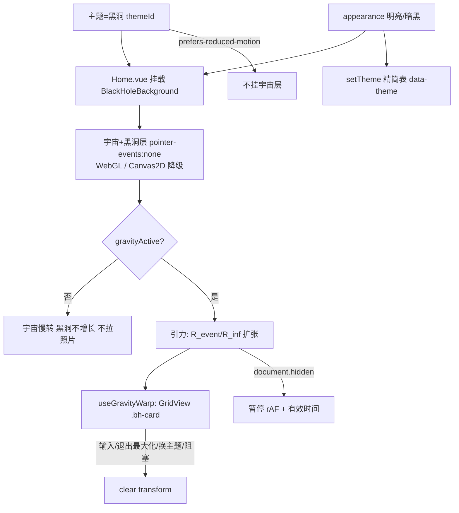

# 黑洞主题（Black Hole Idle Theme）设计文档

> 状态：设计稿 **v1.4** 为基线；**2026-07-26 产品实现已收敛**（见下方「现状」）。手动 QA 仍建议过一遍。
> 范围：纯前端（`src-vite`）；扫描/RAW 相关性能修复在 Rust，见 `docs/guide/目前的开发情况.md` 2026-07-26。
> 目标（v1.4）：设置主题选「黑洞」启用宇宙氛围；主窗最大化且空闲后启动照片区引力特效。
> 背景渲染：**宇宙场景 + 中心黑洞**（WebGL 解析近似 + Canvas2D 降级）。
> **无独立「黑洞主题」开关**；主题列表：**默认 / 复古 / CMYK / 黑洞**。
>
> ### 2026-07-26 现状（以代码为准，覆盖文内部分 v1.4 表述）
>
> | 项 | v1.4 原稿 | 当前实现 |
> |---|---|---|
> | 空闲触发 | 15s | **6s**（`Home.vue` `useIdle(6000)`） |
> | 照片特效主路径 | CSS `useGravityWarp` 刚体/多层 warp | **`PhotoVortexLayer` WebGL UV 透镜**（FragCoord 风格）；仅照片区；冻结可见缩略图纹理 |
> | 卡片是否消失 | 不消失、可回弹 | 漩涡层可把纹理吸进视界；**退出 idle/最大化立即恢复网格** |
> | CSS warp | 主路径 | 代码保留，GridView **未驱动** |
> | 配色/强度 | v1.5：appearance 锁定 + `dynamicThemeIntensity` | 已落地 |
> | Chrome | 未强调半透明 | TitleBar z-50；侧栏/顶栏玻璃；内容区 isolate |

---

## 0. 相对 v1 的修订摘要

| v1 | v1.1 |
|---|---|
| 挂 `App.vue` | 挂 **`Home.vue`**（避免 Settings / ImageViewer / ImageEditor 也出黑洞） |
| warp 宿主 `Content.vue` | 宿主 **`GridView.vue`**（虚拟列表与可见卡片的真实所在） |
| 未写阻塞 UI | **`inputStack` 非空 / 库切换遮罩** 时不启引力 |
| 多窗未区分 | 仅主窗 Home；独立大图窗与主窗行为独立 |
| reduced-motion 可静态 | 本期 **整关**（不挂背景、不跑引力） |
| 胶片条未写清 | **GridView 内卡片会吸**（含胶片条模式下的条内缩略图）；预览 `MediaViewer` 本身不吸 |
| `isMaximized` 含糊 | **新增** `uiStore.isMaximized`；`TitleBar` **仅** `viewName==='Home'` 时写入（共享组件硬约束） |
| `gravityActive` 源混写 | **仅在 `Home.vue` computed 组装**，composable / GridView **只消费布尔** |

| v1.2 | v1.3 |
|---|---|
| Canvas2D 慢转盘背景 | **WebGL 解析近似着色器背景**（光子环+吸积盘+轻透镜）+ **Canvas2D 降级档**；照片聚拢仍 CSS |

| v1.3 | v1.4 |
|---|---|
| 独立 `blackHoleMode` 开关 | **取消独立开关**；主题下拉里选「黑洞」即启用 |
| 长主题列表（Daisy 多色） | 主题仅 **默认 / 复古 / CMYK / 黑洞**（明亮/暗黑两套索引表各自 4 项） |
| 背景偏“单黑洞” | **宇宙场景**（星空/星云）+ 中心黑洞；**配色模式（明亮/暗黑）影响宇宙与盘色** |

---

## 1. 已锁定的产品决策

| 决策点 | 结论 |
|---|---|
| 形态 | **主题菜单中的「黑洞」**（opt-in）；**无**单独 toggle |
| 主题列表 | 明亮/暗黑各自仅 **4 项**：`默认` / `复古` / `CMYK` / `黑洞`；其余 Daisy 主题从菜单移除 |
| 默认项 | 明亮默认 = Daisy `light`；暗黑默认 = Daisy `dark`；**非**黑洞 |
| 黑洞位置 | 屏幕正中央（视口中心，不跟随鼠标） |
| 宇宙背景 | 选中黑洞主题后：全屏 **宇宙**（星空/淡星云）+ **中心黑洞**（非孤立黑圆） |
| 配色模式 | **明亮/暗黑**仍用现有 `settings.appearance`；影响 UI chrome 的 `data-theme` **与** 宇宙/盘的调色（见 §5.3） |
| 作用范围（引力） | **仅主窗 Home 的 `GridView` 缩略图**（含胶片条模式条内卡片） |
| 不作用 | 侧栏、地图、FileInfo、独立 ImageViewer/Editor/Settings 窗、Content 内嵌预览大图本身 |
| 黑洞行为 | **禁止静止增长**：引力触发后缓慢变大（半径/引力范围随有效空闲时长扩张） |
| 照片结局 | 弯折聚拢在事件视界边缘**环绕**（不消失，`opacity` 保持 1） |
| 回弹 | 任意输入 / 退出最大化 / 阻塞 UI / **换离黑洞主题** → 立即清除 transform |
| 引力生效 | **当前主题为黑洞** 且 **系统窗口最大化** 且 **空闲 6s** 且 网格可玩（见 §4） |
| 平时（黑洞主题但未最大化/未空闲） | 宇宙+黑洞氛围慢转，不增长、不拉照片 |
| 背景画质 | **默认 WebGL 解析近似**；失败/弱 GPU → **Canvas2D 宇宙+盘降级**；照片仍 CSS warp |
| 阻塞 UI 时 | **不启引力**；宇宙背景仍可显示 |
| 独立大图窗 | 大图窗不挂宇宙层；主窗按自身条件 |
| 无障碍 | `prefers-reduced-motion: reduce` 时**不挂宇宙/不跑引力**（主题仍可显示为「黑洞」名，但无动效层） |

---

## 2. 架构总览



### 2.1 组件职责

| 单元 | 职责 | 不负责 |
|---|---|---|
| `settings.lightTheme` / `darkTheme` | 主题索引（**0 默认 / 1 复古 / 2 CMYK / 3 黑洞**） | 窗口/空闲 |
| `isBlackHoleTheme`（派生） | `currentThemeId === 3`（见 §3.3） | 持久第二开关 |
| `uiStore.isMaximized` | **主窗**系统最大化真相源 | 特效；其它窗口最大化 |
| `TitleBar`（共享） | **仅** `viewName==='Home'` 时同步 `uiStore.isMaximized` | Settings / ImageEditor 写 store |
| `setTheme` / `app.css` themes | 精简菜单对应的 Daisy 名；黑洞用约定 base chrome | 画宇宙 |
| `useIdle` | 全局 **6s** 空闲（Home 生命周期；原 15s） | 是否最大化 |
| `BlackHoleBackground` | **宇宙 + 黑洞** WebGL/Canvas2D；读 appearance 调色；半径增长 | 改卡片 DOM |
| `useGravityWarp` | 消费 `gravityActive` + 半径；节流写 `.bh-card` | 拼 inputStack / isSwitchingLibrary |
| `GridView` | warp 查询根 | 组装全局 UI 条件 |
| `Thumbnail` | **外层 root** `.bh-card` | 自己算引力 |
| `Home.vue` | 主题=黑洞时挂背景；组装 `gravityActive` | 不进 `App.vue` |
| `Settings` 外观区 | **仅**配色模式 + **精简主题下拉**（无黑洞 toggle） | 长主题列表 |

### 2.2 为何挂 Home 而非 App

路由（`src-vite/src/common/router.js`，已核对）：

| path | name | 是否挂黑洞 |
|---|---|---|
| `/` | Home | **是**（唯一） |
| `/image-viewer` | ImageViewer | 否 |
| `/image-editor` | ImageEditor | 否 |
| `/settings` | Settings | 否 |

四条均经 `App.vue` 的 `router-view`。黑洞是**主相册氛围**，挂 `Home` 可避免设置窗/大图窗/编辑器出现特效层。

---

## 3. 新增 / 修改的状态

### 3.1 `src-vite/src/stores/uiStore.js`（**新增字段，当前不存在**）

现状：`isMaximized` **不在** `uiStore`。现有两处均为**组件本地** `ref`：

- `TitleBar.vue` 内部 `const isMaximized = ref(false)`（按钮图标用）
- `MediaViewer.vue` 内部另一个 `isMaximized`（独立桌面窗控件，**本功能永不接入**）

本期 plan：

```js
state: () => ({
  // ...existing...
  isMaximized: false, // 主窗是否系统最大化（引力前提之一）
})
// action: setMaximized(value: boolean)
```

- **语义**：只表示 **Home 主窗**是否系统最大化。
- **写入方**：仅 §3.2 约束下的 Home `TitleBar`（或等价的仅-Home 同步逻辑）。
- **不要**与下列概念混用：
  - `configStore` / `settings` 路径上的 **`imageViewer.isFullScreen`**（`configStore.js`：大图窗原生全屏，**非本功能**）
  - `MediaViewer` 组件**本地** `isMaximized` ref（独立桌面窗控件）
  - 注：`Home.vue` 模板里有 `uiStore.isFullScreen` 写法，但 **`uiStore` 并无该字段**（既有无效/死引用）；本功能**不要**去「实现」或复用它，只新增并使用 **`uiStore.isMaximized`**。

### 3.2 `src-vite/src/components/TitleBar.vue`（共享组件 — **硬约束**）

`TitleBar` 被多个视图共用（已核对 import）：

| 视图 | `viewName` | 是否写 `uiStore.isMaximized` |
|---|---|---|
| `Home.vue` | `'Home'` | **是** |
| `Settings.vue` | `'Settings'` | **否** |
| `ImageEditor.vue` | `'ImageEditor'` | **否** |
| ImageViewer / MediaViewer | 自有控件，非本 TitleBar 路径或不走 Home | **否**（MediaViewer 本地 `isMaximized` 维持本地） |

实现规则：

1. **守卫**：仅当 `props.viewName === 'Home'` 时调用 `uiStore.setMaximized(...)`；其它 `viewName` 可继续用组件内本地 `ref` 画最大化/还原图标，但**禁止**写 store。
2. **点击切换**（现有 `toggleMaximizeWindow`）：Home 分支在 `isMaximized()` then 分支里同步 store + 本地 ref。
3. **非平凡必做（当前代码没有）**——须**新增**，不能只靠点击：
   - **挂载初始化**：`await getCurrentWindow().isMaximized()` → 本地 ref；若 `viewName==='Home'` 再 `setMaximized`。
   - **窗口事件监听**：`onResized` 和/或平台 maximize/unmaximize 相关 API，在系统快捷键、双击标题栏、任务栏操作后再次 `isMaximized()` 并同步。
   - **卸载**：取消 listen，避免 Settings 短窗泄漏监听（即使守卫不写 store，监听器也只应在需要同步的实例上挂，或统一挂但写 store 仍受 `viewName` 守卫）。
4. 推荐实现形状：`const syncMaximizedToStore = viewName === 'Home'`；所有读窗状态的路径都走同一 `applyMaximizedState(bool)`，内部 `localRef = bool; if (sync) uiStore.setMaximized(bool)`。

### 3.3 主题索引与「是否黑洞」（**取代** `blackHoleMode` 开关）

#### 3.3.1 精简主题表（与 `setTheme` / i18n 同步）

明亮（`appearance === 0`）与暗黑（`appearance === 1`）**各自**索引：

| themeId | 菜单名 zh / en | Daisy `data-theme`（chrome） |
|---|---|---|
| 0 | 默认 / Default | 明亮：`light`；暗黑：`dark` |
| 1 | 复古 / Retro | 明亮：`retro`；暗黑：**`coffee`**（已锁定） |
| 2 | CMYK / CMYK | 明亮/暗黑均：**`cmyk`**（已锁定，不变） |
| 3 | 黑洞 / Black hole | **chrome 底座**：明亮 `light`；暗黑 `dark`（或 `black`，实现时与默认暗色一致即可）；**宇宙层由 `BlackHoleBackground` 画，不靠 Daisy 内置「黑洞」主题名** |

> 说明：菜单只留这四项。`app.css` 的 `themes:` 白名单至少保留：`light`、`dark`、`retro`、`coffee`、`cmyk`（及黑洞 chrome 若用 `black`/`abyss` 再列入）；其余可收紧以减小 CSS。

#### 3.3.2 持久化与迁移

- **删除**（或停止使用）`settings.blackHoleMode` 布尔开关；已落盘的 `true` 在 hydrate 时：
  - 将当前 appearance 对应的 `lightTheme` 或 `darkTheme` **钳到 3（黑洞）** 一次，然后可忽略该字段。
- 旧用户 `lightTheme` / `darkTheme` 若 **≥ 4**（旧长列表索引）：**钳到 0（默认）**，避免越界读到 `undefined`。
- `setTheme(appearance, themeId)` 数组改为长度 4，与上表一致。

#### 3.3.3 派生布尔

```ts
// Home / Settings / background 共用
// 注：v1.5 已把本伪代码精化为三参数签名，与 utils.ts:46-53 真实实现一致
// （v1.4 此处曾以 (settings) 简写表示，语义等价）
function isBlackHoleTheme(
  appearance: number,
  lightTheme: number,
  darkTheme: number,
): boolean {
  const id = appearance === 0 ? lightTheme : darkTheme;
  return Number(id) === 3;
}
```

- **挂载宇宙层**：`isBlackHoleTheme && !reducedMotion`
- **不要**再引入第二套 persist 开关。

### 3.4 Settings UI

- **删除**外观区独立「黑洞主题」toggle 行（若分支已加，实现时去掉）。
- 主题 `<select>` 仅 4 项（i18n `theme_options_light` / `theme_options_dark` 各 4 字符串）。
- 可选：选中黑洞时在主题行下方一行 hint（原 `black_hole_theme_hint` 文案可复用）。

---

## 4. 空闲与 gravityActive

### 4.1 `useIdle.ts`

全局监听 `mousemove` / `keydown` / `scroll` / `wheel` / `touchstart`（`passive: true`），任意活动重置 **6s** 定时器（实现：`useIdle(6000)`）。

```ts
export function useIdle(ms = 6000) {
  const idle = ref(false);
  // reset → idle=false; timeout → idle=true
  // onMounted 注册; onUnmounted 清理
  return { idle };
}
```

建议在 **Home** 内使用，随 Home 卸载而清理。

### 4.2 `gravityActive`（**组装点 = Home.vue only**）

```text
gravityActive =
  isBlackHoleTheme          // themeId === 3（当前 appearance 下）
  && uiStore.isMaximized
  && idle
  && !reducedMotion
  && !document.hidden
  && uiStore.inputStack.length === 0
  && !isSwitchingLibrary
```

**作用域硬约束：**

| 符号 | 所在 | 谁可读 |
|---|---|---|
| `isBlackHoleTheme` | 由 `lightTheme`/`darkTheme`+`appearance` 派生 | Home / 任意 |
| `uiStore.isMaximized` | uiStore | Home |
| `idle` | `useIdle()` @ Home | Home |
| `reducedMotion` | Home `matchMedia` | Home |
| `document.hidden` | visibility 映射 | Home |
| `uiStore.inputStack` | uiStore | Home |
| `isSwitchingLibrary` | **Home 本地 ref** | **仅 Home** |

1. **`gravityActive` 仅在 Home `computed` 组装**。
2. provide/inject 或 prop 下传布尔 + 半径；warp **只消费**传入值。
3. 换离主题 id=3 → `gravityActive` false → clear warp + 卸宇宙层。
4. `document.hidden`：暂停 rAF 与有效空闲时长。

### 4.3 网格「可玩」边界

| 场景 | 宇宙背景 | 引力 |
|---|---|---|
| 主题=黑洞，普通浏览 | 有 | 否（除非最大化+空闲+…） |
| 主题≠黑洞 | 无 | 无 |
| `inputStack.length > 0` | 有（若主题=黑洞） | 否 |
| 库切换 `isSwitchingLibrary` | 有 | 否 |
| Content 胶片/quick view | 有 | GridView 卡可吸；预览大图不吸 |
| 独立 `/image-viewer` | 该窗无 | 主窗按自身条件 |
| `/settings`、`/image-editor` | 无（未挂 Home） | 无 |

---

## 5. 黑洞本体：`BlackHoleBackground.vue`（宇宙 + WebGL / Canvas2D）

- 仅由 **`Home.vue`** 在 `isBlackHoleTheme && !reducedMotion` 时挂载。
- `position: fixed; inset: 0; pointer-events: none`；z-index 在网格内容之下、主壳背景之上。
- **场景内容（必须有宇宙，不只是黑洞）**：
  - 远景：程序化 **星空**（稳定哈希星点 + 少量闪烁可选极弱）
  - 中景：淡 **星云/尘埃** 色块或噪声（低对比，勿抢照片）
  - 近景中心：**事件视界** + **吸积盘**（极坐标、伪多普勒左右不对称）+ **光子环**
  - 可选：星场轻微 **径向透镜**（屏幕空间，解析近似）
- **渲染分层（两档）**：
  - **高画质（默认 WebGL）**：全屏 canvas + 片元着色器，**无新 npm 依赖**（裸 WebGL/WebGL2 + 内联 GLSL）。
    - **解析近似，非 geodesic raytrace**。
    - **性能三开关**：① 内部分辨率上限（如 `0.5×`）；② 20–30fps；③ `document.hidden` 停 rAF。
  - **降级（Canvas2D）**：星点 + 径向渐变盘 + 黑圆；WebGL 失败时必走此路。
- **背景模式**：`R0` 固定，盘/宇宙慢转，无增长、不拉照片。
- **引力模式**：`R_event` 随有效空闲增大，辉光可略加强；宇宙可略加快视差。

### 5.1 增长曲线（引力模式）

```ts
const elapsed = effectiveIdleSeconds;           // 仅前台累加
const k = 1 - Math.exp(-elapsed / 8);          // ~25s → ~95%
const R_event = lerp(R_event0, R_eventMax, k);
const R_inf   = lerp(R_inf0,   R_infMax,   k);
```

- `R0` / `R_event0` ≈ `0.06 * min(vw, vh)`
- `R_eventMax` ≈ `0.16 * min(vw, vh)`
- `R_inf0` 略大于 `R_event0`
- `R_infMax` ≈ `0.92 * Math.hypot(vw, vh) / 2`

半径由 background 算出，经 provide 交给 `useGravityWarp`。

### 5.2 实现钉点（相对当前分支）

- 已有 Canvas2D 版：升级为 **WebGL 优先 + Canvas2D 宇宙降级**。
- props/emit 契约建议保持：`gravityActive`、`effectiveElapsedSec`、`emit('radii', …)`；**新增** prop 或读取 `appearance`（0/1）与 CSS 变量以调色。
- 弱 GPU：context 失败 / compile 失败 → 降级即可。

### 5.3 配色模式（明亮 / 暗黑）对宇宙层的影响

`settings.appearance` 与黑洞主题**正交**：同一「黑洞」菜单项在两种配色下都可选，但画面不同。

| 维度 | 暗黑（appearance=1，默认更贴宇宙） | 明亮（appearance=0） |
|---|---|---|
| 宇宙底板 | 近黑 / 深蓝黑 | 深靛蓝～灰蓝，**略亮**，避免整窗死黑难读 UI |
| 星点 | 偏冷白、对比高 | 略少/略淡，避免刺眼 |
| 星云 | 紫/青低饱和 | 更淡的青灰/暖灰雾 |
| 吸积盘 / 光子环 | 可偏 `primary` + 暖橙一侧伪多普勒 | 仍跟 `--color-primary`，整体亮度抬一点、饱和略收 |
| UI chrome | `data-theme` 用暗底座（如 `dark`/`black`） | `data-theme` 用亮底座（如 `light`），保证侧栏/按钮可读 |

实现：shader uniforms（如 `uAppearance`、`uPrimaryRgb`）或 2D 路径读 computed style；**切换明亮/暗黑时宇宙层即时换色**，不必重挂组件。

---

## 6. 引力形变：`useGravityWarp`

仅 `gravityActive` 时对 **GridView 根下可见** `.bh-card` 写样式。

### 6.1 变换公式

```
cx, cy   = 卡片中心（该重算周期 getBoundingClientRect，缓存至下轮）
HX, HY   = 视口中心
dx, dy   = cx - HX, cy - HY
dist     = hypot(dx, dy)
angle    = atan2(dy, dx)
t        = clamp((R_inf - dist) / R_inf, 0, 1)

targetR  = lerp(dist, R_event, smoothstep(t))
orbit    = orbitPhase * (0.2 + 0.8 * t)
a2       = angle + orbit
nx, ny   = HX + targetR*cos(a2), HY + targetR*sin(a2)
tx, ty   = nx - cx, ny - cy
scale    = lerp(1, 0.45, t)
rotDeg   = (a2 - angle) * 180/PI + swirl*t
blur     = t > 0.7 ? lerp(0, 3, (t-0.7)/0.3) : 0

transform = translate(tx,ty) rotate(rotDeg) scale(scale)
filter    = blur > 0 ? blur(Npx) : none
// 永不改 opacity
```

- `orbitPhase += dt * 0.15`（仅引力模式）
- `dist > R_inf` → 清空该卡 transform/filter
- 样式写在 **Thumbnail 外层 root** 的 `.bh-card` 上，**不要**写在：
  - 内层 `ref="containerRef"`（该节点 `:style="layoutStyle"`，几何网格 justified/masonry 下会写尺寸/定位，避免和 transform 抢 style）
  - 更内层的 `img` / `video`（已有 `group-hover:scale-115` / 选中 `scale-115`）
- 分层（有意保留）：
  - **外层 root**（模板最外层那个 `div`，约第 2 行）：已有 `transition-all ease-in-out duration-300`（除非 `isTransitionDisabled`）→ 正好复用 §6.2「~120ms 重算 + CSS 过渡」；class 列表合并加入 `bh-card`
  - **内层 containerRef**：只负责媒体框 layout
  - **img/video**：只负责 hover/选中 scale  
  外层引力 transform 与内部 scale **嵌套相乘**，互不覆盖

### 6.2 性能策略

- **节流重算**：约 **120ms** 一轮；帧间靠 CSS `transition`（与 Thumbnail 现有 transition 协调；gravity 期间确保 transform 可过渡）。
- **查询范围**：`gridRoot.querySelectorAll('.bh-card')` 仅当前 DOM（虚拟列表 buffer 内）。
- **不**跨回收保 card 身份；每轮按当前 DOM 写入即可。
- **`will-change: transform`**：仅 `gravityActive` 期间；clear 后移除。
- **blur** 仅 `t > 0.7`，半径 ≤ 3px。
- **滚动**：wheel/scroll 会使 `idle=false` → 整表 clear；**不**做边滚边吸。

### 6.3 回弹 / clear

任一条件触发 clear：

- `idle === false`
- `isMaximized === false`
- 离开黑洞主题（`themeId !== 3`）
- `inputStack.length > 0` / 库切换 / `document.hidden` / reduced-motion

动作：去掉内联 `transform` / `filter` / `will-change`；停 orbit 与有效增长；依赖 CSS 回到 VirtualScroll 布局位置。  
**不**用 JS 弹簧改 layout box，**不**改 VirtualScroll 几何。

### 6.4 集成位置

- **`GridView.vue`**：提供 scroller/容器 ref；`gravityActive` 变化时 `apply` / `clear`（或 watch 交由 composable）。
- **`Thumbnail.vue`**：在**外层 root** `div` 的 class 列表增加 `bh-card`（不要加在 `containerRef` 上）。
- **不**以 `Content.vue` 为 query 根（易扫到非网格节点、职责过重）。

---

## 7. 接入点清单

| 文件 | 改动 |
|---|---|
| `src-vite/src/common/utils.ts` | `setTheme` 表改为 4 项；导出 `isBlackHoleTheme` / 主题常量（可选） |
| `src-vite/src/assets/app.css` | `themes:` 白名单可收紧到实际用到的 Daisy 名 |
| `src-vite/src/locales/en.json` / `zh.json` | `theme_options_*` 仅 4 项；黑洞 hint；**去掉**独立 toggle 长文案或改作 hint |
| `src-vite/src/stores/configStore.js` | 迁移：废 `blackHoleMode`；clamp 旧 theme 索引；setter 不变语义 |
| `src-vite/src/views/Settings.vue` | 主题下拉 4 项；**删除**黑洞 toggle；可选 hint |
| `src-vite/src/main.js` | 可删 `settings-blackHoleMode-changed` 监听（若已加） |
| `src-vite/src/composables/useIdle.ts` | 空闲检测 |
| `src-vite/src/composables/useGravityWarp.ts` | 卡片 warp |
| `src-vite/src/components/BlackHoleBackground.vue` | **宇宙+黑洞** WebGL + Canvas2D；appearance 调色 |
| `src-vite/src/stores/uiStore.js` | `isMaximized` + `setMaximized` |
| `src-vite/src/components/TitleBar.vue` | 仅 Home 写 maximize |
| `src-vite/src/views/Home.vue` | `isBlackHoleTheme` 挂载；组装 `gravityActive` |
| `src-vite/src/components/GridView.vue` | inject warp |
| `src-vite/src/components/Thumbnail.vue` | 外层 `.bh-card` |
| `App.vue` / `Content.vue` | 不作宇宙宿主 |
| `MediaViewer.vue` | 不改本地 maximize |

---

## 8. 性能预算

| 场景 | CPU | GPU/合成 | 内存 | 说明 |
|---|---|---|---|---|
| 主题≠黑洞 / reduced-motion | 0 | 0 | 0 | 不挂宇宙层 |
| 黑洞主题背景（WebGL） | 极低 | 低~中（分辨率上限+低帧率） | 低 | 宇宙+盘，解析近似 |
| 黑洞主题背景（Canvas2D） | 极低 | 低 | 忽略 | 降级 |
| 引力模式 | 低~中（~120ms） | 中 + 背景 WebGL | 低 | 仅可见 `.bh-card` |
| 输入/隐藏/换主题 | 0 | 0 | 0 | clear + 停 rAF |

- **新依赖：无**（裸 WebGL + CSS；不引 three.js）
- **包体增量：≪ 0.1 MB gzip**（着色器为内联 GLSL 文本）
- **Rust / exe：不变**

---

## 9. i18n 文案 key（建议）

主题列表（**各 4 项，顺序固定**）：

```text
settings.general.theme_options_light / theme_options_dark:
  [0] 默认 / Default
  [1] 复古 / Retro
  [2] CMYK / CMYK
  [3] 黑洞 / Black hole
```

可选 hint（主题行下，仅当 id=3 时显示）：

```text
settings.general.black_hole_theme_hint
  zh: 宇宙氛围背景；窗口最大化后发呆约 6 秒释放引力（可随时回弹）
  en: Cosmic ambient background; ~6s idle while maximized enables gravity (always reversible)

settings.general.black_hole_theme_reduced_motion
  zh: 系统已开启「减少动态效果」，宇宙动效不会运行
  en: Reduced motion is on; cosmic motion stays off
```

**删除**独立 toggle 用的 `black_hole_theme` / `_desc` 作为开关标题（可并入 hint）。

---

## 10. 实现顺序

1. 主题表瘦身：`setTheme` + i18n 4 项 + 旧索引 clamp 迁移；去掉 `blackHoleMode` UI/监听
2. `uiStore.isMaximized` + TitleBar 仅 Home 同步（若尚未完成）
3. `BlackHoleBackground`：宇宙+黑洞，WebGL + Canvas2D，appearance 调色；Home 按 `isBlackHoleTheme` 挂载
4. `useIdle` + Home `gravityActive`（`isBlackHoleTheme && …`）
5. `.bh-card` + `useGravityWarp` + GridView
6. WebGL 三开关 + will-change 清理
7. §11 自测

---

## 11. 自测清单

| # | 步骤 | 期望 |
|---|---|---|
| 1 | 主题=默认 | 无宇宙层、无 transform |
| 2 | 主题菜单仅 4 项 | 默认/复古/CMYK/黑洞 |
| 3 | 选黑洞，非最大化 | 宇宙+中心黑洞慢转；照片不动 |
| 3b | 黑洞 + 切换明亮/暗黑 | UI chrome 与宇宙调色都变；仍可读 _(已被 v1.5 替代：v1.5 把 appearance select 在黑洞下 `disabled`，不再允许切换)_ |
| 3c | WebGL 失败 | Canvas2D 宇宙降级，不崩 |
| 4 | 黑洞+最大化后立即操作 | 仅氛围，无引力 |
| 5 | 黑洞+最大化静止 ≥6s | 照片区 WebGL 漩涡（PhotoVortex）；动鼠标回弹网格 |
| 6 | 引力中输入 | 立即回弹 |
| 7 | 引力中还原窗口 | 回弹；氛围保留 |
| 7b | Settings 窗最大化 | 不污染主窗 `isMaximized` |
| 8 | 换到默认/复古/CMYK | 立刻卸宇宙 + clear warp |
| 9 | inputStack / 库切换 | 抑引力；氛围可在 |
| 10 | ImageViewer / Settings 路由窗 | 无宇宙层 |
| 11 | 胶片条 | 条内卡可吸；预览不吸 |
| 12 | 虚拟列表进出 | 无残留 transform |
| 13 | reduced-motion | 无宇宙动效层 |
| 14 | 旧配置 themeId 很大 | 启动后钳到默认，不白屏 |

---

## 12. 非目标（本期不做）

- 逐像素测地线积分 raytracer（GARGANTUA 那种全透镜，性能重）；本期仅用解析近似着色器
- SVG `feDisplacementMap` 真透镜 / three.js
- ~~对照片做 WebGL 真透镜扭曲~~ **（2026-07-26 已用 PhotoVortexLayer 落地简化 UV 透镜；非测地线 raytracer）**
- 黑洞跟随鼠标或多位置
- 吸侧栏、地图、非 GridView 的 Thumbnail
- 改 Rust / IPC / DB / AI / 包体模型
- 为黑洞单独做完整 Daisy 主题 token 包（本期仅用现有 light/dark 等作 chrome 底座 + 自绘宇宙）
- 保留旧版几十项 Daisy 主题菜单（**明确删除**）
- 独立「黑洞主题」设置开关（**明确删除**，改主题下拉）

---

## 13. 未来可选（非本期）

- 背景升级为真逐像素测地线 raytracer（GARGANTUA 级，需更强 GPU 预算）
- 照片近事件视界真透镜扭曲（替代/增强 §6 CSS warp）
- 黑洞位置：正中 / 跟随鼠标 / 角落
- 低性能设备自动分级（更细于本期 Canvas2D 降级档）
