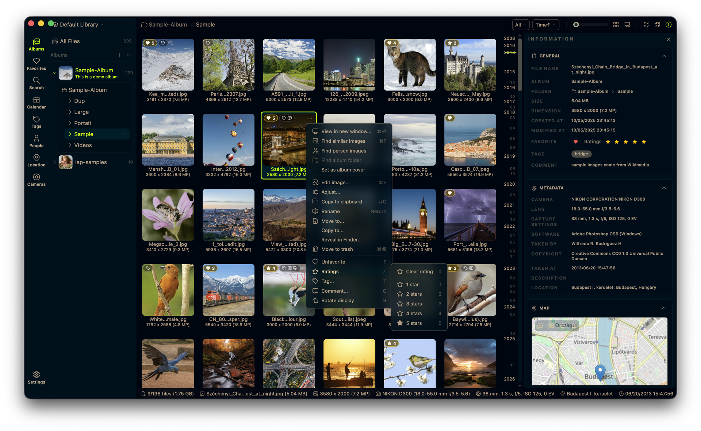
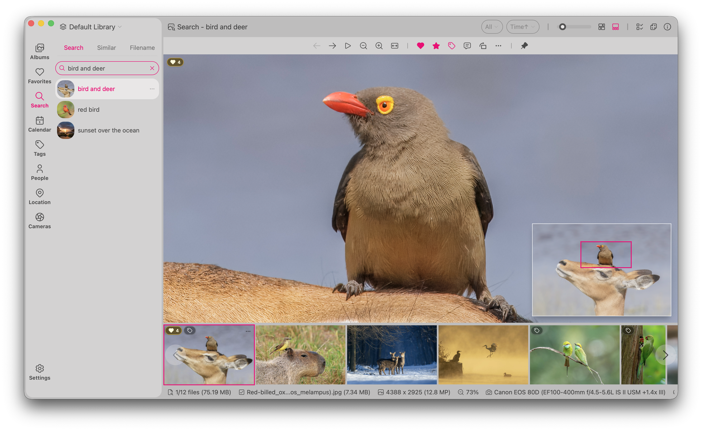

<div align="center">
  
  <h1>PicAiPic - 私人本地照片管理器</h1>
  <h3>适用于 Windows 和 Linux 的开源桌面照片管理工具。</h3>
  <p>
    <a href="https://github.com/big2cater/picaipic/releases"></a>
    <a href="https://github.com/big2cater/picaipic/releases"></a>
    <a href="https://github.com/big2cater/picaipic/stargazers"></a>
  </p>
</div>

[English](../README.md) | 简体中文

PicAiPic 是一款开源、本地优先的照片管理器，旨在帮助您轻松浏览家庭相册、快速找回旧照片，并离线管理庞大的个人多媒体库。
它是云端照片服务的隐私替代方案：无强制上传、内置本地 AI 搜索、以文件夹为中心的工作流，且完全免费使用。

- 官方网站: [https://big2cater.github.io/picaipic/](https://big2cater.github.io/picaipic/)
- 演示视频: [https://youtu.be/RbKqNKhbVUs](https://youtu.be/RbKqNKhbVUs)
- 隐私策略: [PRIVACY.md](../PRIVACY.md)

## 下载 PicAiPic

打开 [最新版本发布页面](https://github.com/big2cater/picaipic/releases/latest)，下载匹配您系统的文件：

| 平台 | 安装包 | 备注 |
| :-- | :-- | :-- |
| **Windows 10/11 (x64 / ARM64)** | `_x64_en-US.msi` / `_arm64_en-US.msi` | 未签名 — 如果 SmartScreen 阻止下载，请点击**仍要保留** |
| **Linux (amd64 / arm64)** | `_amd64.deb` / `_arm64.deb` | 适用于 Debian 系发行版（Ubuntu、Debian、Linux Mint 等） |

## 界面预览

<p align="center">
  
</p>

<p align="center">
  
</p>

## 为什么选择 PicAiPic

- **本地优先设计**：照片保存在您自己的硬盘上，无需云账号或强制上传。
- **不锁定媒体库**：直接使用现有文件夹，而不是把所有内容导入封闭数据库。
- **私有 AI 工具**：搜索、相似图片、智能标签和人脸功能都在本机运行。
- **面向大图库构建**：针对 100k+ 文件的媒体库进行流畅浏览和整理优化。
- **开源且免费**：无订阅、无强制生态绑定，代码可自行审查。

## 功能特性

- **快速图库浏览**：支持时间线、文件夹、地点、相机、镜头、标签、收藏、评分和人脸筛选。
- **本地 AI 搜索**：支持文本搜索、视觉相似搜索、智能标签、人脸聚类，以及可选的 50+ 语言多语言搜索。
- **文件夹优先工作流**：支持多个媒体库、拖放导入、复制粘贴导入、文件系统同步，以及安全的移动/复制/删除操作。
- **清理工具**：查找重复文件，并批量移动不需要的文件到废纸篓。
- **内置编辑**：支持裁剪、旋转、翻转、缩放和基础图像调整。
- **广泛格式支持**：支持 60+ 种照片、RAW 和视频格式。

## 当前开发状态

PicAiPic 当前处于 `v1.0.0` 宿主/插件基线。近期已经完成：

- 活跃界面、更新器、打包配置、文档和数据目录中的 Lap → PicAiPic 品牌迁移
- AI 插件包签名与发布者信任、启动令牌、权限/安装流程、运行时冲突门禁和输入文件预拷贝
- shared、plugin-private、external 三类 Python 运行时绑定，以及 manifest 驱动的外部模型目录绑定
- 切换图库后延迟缩略图/预览请求的跨图库隔离
- 插件最低/最高 PicAiPic 版本兼容性校验
- 首页组件按需加载，Home 入口 chunk 从约 527 KB 降至约 15 KB

下一阶段重点是 release 可执行文件的插件回归、带用户确认的 shared → plugin-private 一键回退、插件签名密钥轮换/撤销设计，以及更强的网络和 Linux 插件隔离。

## 卸载 PicAiPic

PicAiPic 直接使用您现有的照片文件夹。卸载 PicAiPic 或删除其数据库和缓存文件，**不会**删除您的原始照片。

常规卸载只会移除应用程序。如需彻底删除 PicAiPic，请先退出 PicAiPic，卸载应用程序，然后按照对应平台的命令删除本地数据库、缩略图缓存和配置文件。

### Windows

打开 **设置 > 应用 > 已安装的应用**，找到 **PicAiPic** 并选择 **卸载**。

然后打开 PowerShell，删除所有 PicAiPic 数据库、缓存和配置文件：

```powershell
Remove-Item -Recurse -Force -ErrorAction SilentlyContinue "$env:LOCALAPPDATA\com.big2cater.picaipic"
Remove-Item -Recurse -Force -ErrorAction SilentlyContinue "$env:APPDATA\com.big2cater.picaipic"
```

### Linux

对于基于 Debian 的发行版，请卸载软件包：

```bash
sudo apt remove picaipic
```

然后删除所有 PicAiPic 数据库、缓存和配置文件：

```bash
rm -rf "$HOME/.local/share/com.big2cater.picaipic" \
       "$HOME/.cache/com.big2cater.picaipic" \
       "$HOME/.config/com.big2cater.picaipic"
```

如果您在 PicAiPic 设置中选择了自定义数据库存储目录，请在确认其中仅包含 PicAiPic 数据库文件后，单独删除该目录。

## 源码编译

编译要求: Node.js 20+, pnpm, Rust stable.

```bash
# Linux 系统依赖
# sudo apt install libwebkit2gtk-4.1-dev libappindicator3-dev librsvg2-dev \
#   patchelf nasm clang pkg-config autoconf automake libtool cmake

# 克隆并编译
git clone --recursive https://github.com/big2cater/picaipic.git
cd picaipic
git submodule update --init --recursive
cargo install tauri-cli --version "^2.0.0" --locked
./scripts/download_models.sh            # Windows: .\scripts\download_models.ps1
./scripts/download_ffmpeg_sidecar.sh    # Windows: .\scripts\download_ffmpeg_sidecar.ps1
cd src-vite && pnpm install && cd ..
cargo tauri dev
```

## 支持格式

PicAiPic 支持 60+ 种照片、RAW 和视频格式。

| 类型 | 格式清单 |
| :--- | :--- |
| 常规图片 | JPG/JPEG, PNG, GIF, BMP, TIFF, WebP, HEIC/HEIF/HIF, AVIF, JXL, PSD, EXR, HDR/RGBE, TGA, JPEG 2000 (JP2/J2K/J2C/JPC/JPF/JPX), DDS, DPX, QOI |
| RAW 照片 | CR2, CR3, CRW, NEF, NRW, ARW, SRF, SR2, RAF, RW2, ORF, PEF, DNG, SRW, RWL, MRW, 3FR, MOS, DCR, KDC, ERF, MEF, RAW, MDC |
| 视频 | MP4, MOV, M4V, MKV, AVI, FLV, TS/M2TS, WMV, WebM, 3GP/3G2, F4V, VOB, MPG/MPEG, ASF, DIVX 等。Windows 和 Linux 均支持 H.264 播放；在不支持原生播放时，系统会自动进行兼容性处理。 |

### Linux 视频播放备注

在 Linux Mint/Ubuntu/Debian 上，请安装以下软件包以获得更好的视频播放支持：

```bash
sudo apt install gstreamer1.0-libav gstreamer1.0-plugins-good
```

## 技术架构

- 核心: Tauri + Rust
- 前端: Vue + Vite + Tailwind CSS
- 数据: SQLite

### 关键库

| 库 | 用途 |
| :-- | :-- |
| [LibRaw](https://github.com/LibRaw/LibRaw) | RAW 图像解码与缩略图提取 |
| [libheif](https://github.com/strukturag/libheif) | HEIC/HEIF/HIF 图像解码与预览生成 |
| [libjpeg-turbo](https://libjpeg-turbo.org/) | 快速 JPEG 解码与缩略图生成 |
| [FFmpeg](https://ffmpeg.org/) | 视频处理与缩略图生成 |
| [Video.js](https://videojs.com/) | 跨平台视频播放界面 |
| [ONNX Runtime](https://onnxruntime.ai/) | 本地 AI 模型推理引擎 |
| [CLIP](https://github.com/openai/CLIP) | 图文相似度搜索 |
| [InsightFace](https://github.com/deepinsight/insightface) | 人脸检测与识别 |
| [Leaflet](https://leafletjs.com/) | 用于地理位置照片的交互式地图 |
| [daisyUI](https://daisyui.com/) | 界面 UI 组件库 |

## 开源协议

GPL-3.0-or-later。详情请参阅 [LICENSE](../LICENSE)。
